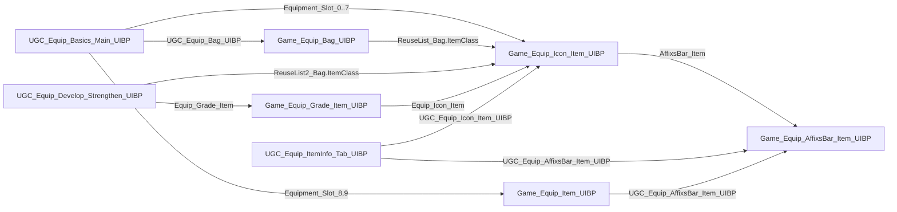

# 引擎装备 Prefab 迁移到项目（Game_ 前缀）

## 目标
把 5 个引擎 prefab 复制为项目资产，命名 `Game_` 前缀，放到 `/TTS/Asset/Blueprint/Prefabs/UI/Equip/Item/`（Lua 自动对应 `Script/Blueprint/Prefabs/UI/Equip/Item/*.lua`）。之后所有 UI 节点可直接在 UMG 编辑，Lua 走正常 Construct/Destruct，不再需要 `Script/Equip/UIBP/Item/` 的代理包装。

## 资产映射
- `/Game/UGC/UITemplate/Asset/Equip/UIBP/Item/UGC_Equip_Icon_Item_UIBP` → `Game_Equip_Icon_Item_UIBP`
- `.../UGC_Equip_AffixsBar_Item_UIBP` → `Game_Equip_AffixsBar_Item_UIBP`（Icon 内嵌；顺带摆脱引擎按类名绑的 `LostTombAffixsBar` 报错）
- `.../UGC_Equip_Bag_UIBP` → `Game_Equip_Bag_UIBP`
- `.../UGC_Equip_Grade_Item_UIBP` → `Game_Equip_Grade_Item_UIBP`
- `.../UGC_Equip_Item_UIBP` → `Game_Equip_Item_UIBP`

不动：`Common_DragDrop_Item / Common_Currency / ReuseList2 / NewButton / Level1、Level2 Tabs`。

## 依赖关系

复制顺序按叶子到根：AffixsBar → Icon → Item / Grade / Bag，每复制一个就把它内部对引擎版的引用改成 `Game_` 版。

## 阶段 0：可行性测试（先做这一步，做完向你汇报）
用影响最小的 `UGC_Equip_Item_UIBP`（武器大格子，无逻辑）试三件事：
1. `ue.duplicate_asset('/Game/UGC/UITemplate/Asset/Equip/UIBP/Item/UGC_Equip_Item_UIBP', '/TTS/Asset/Blueprint/Prefabs/UI/Equip/Item/Game_Equip_Item_UIBP')` 是否允许从 `/Game` 复制到 `/TTS`，`widget_inspect` 副本树是否完整。
2. `ue.widget_swap(BasicsBP, 'Equipment_Slot_8', 'Game_Equip_Item_UIBP_C')` 能否把内嵌 UserWidget 换成项目类并保留 Slot 布局；不行则试 `widget_remove` + `widget_add` + `widget_slot` 还原坐标。
3. 新建 `Script/Blueprint/Prefabs/UI/Equip/Item/Game_Equip_Item_UIBP.lua` 带 `Construct` 打印，重启 PIE 确认项目副本能收到 Lua 生命周期。

任何一步失败即停，把失败点和需要你手动做的事列出。

## 阶段 1：复制 5 个资产 + 改内部引用（脚本）
- 依次 duplicate，每个之后 `compile_blueprint` + 保存。
- `Game_Equip_Icon_Item_UIBP.AffixsBar_Item` → `Game_Equip_AffixsBar_Item_UIBP_C`
- `Game_Equip_Bag_UIBP.ReuseList_Bag.ItemClass` → `Game_Equip_Icon_Item_UIBP_C`
- `Game_Equip_Grade_Item_UIBP.Equip_Icon_Item` → `Game_Equip_Icon_Item_UIBP_C`
- `Game_Equip_Item_UIBP.UGC_Equip_AffixsBar_Item_UIBP` → `Game_Equip_AffixsBar_Item_UIBP_C`
- 项目 BP 引用：Basics 8 个 Slot + 2 个武器格 + Bag；Strengthen `Equip_Grade_Item` + `ReuseList2_Bag.ItemClass`；ItemInfo_Tab 的 Icon 与 AffixsBar。

## 阶段 2：Lua 重写（代理 → 绑定脚本）
- 新建 `Script/Blueprint/Prefabs/UI/Equip/Item/Game_Equip_Icon_Item_UIBP.lua`：把现有 `ApplyData/SetIcon/SetQuality/SetUsing/SetFittingName/SetItemLevel/BindClick` 改成 `self` 上的普通方法，`bClickBound/Data` 存 self；Construct 里直接打开 NotWornState 外层面板、收起 Unusable，删掉 ProxyCache/WeakObjectPtr/`New`。
- `Game_Equip_Bag_UIBP.lua`：`ReloadItems/OnUpdateItem/BindItemClick/Clear` 直接在 self 上；Owner 通过 `InitData({Owner=...})` 传入。
- `Game_Equip_Grade_Item_UIBP.lua`、`Game_Equip_Item_UIBP.lua`、`Game_Equip_AffixsBar_Item_UIBP.lua`：先放最小骨架（Construct/InitData）。
- [UGC_Equip_Basics_Main_UIBP.lua](e:\WeGameApps\rail_apps\OasisEraEditor(2001776)\ShadowTrackerExtra\UGCProjects\TTS\Script\Blueprint\Prefabs\UI\UGC_Equip_Basics_Main_UIBP.lua)：删 `SlotCtrls/EnsureSlotCtrls/EquipIconItem.New`，改 `self[WidgetName]:ApplyData(...)`、`:BindClick(...)`；Bag 改 `self.UGC_Equip_Bag_UIBP:InitData/ReloadItems`。
- [UGC_Equip_Develop_Strengthen_UIBP.lua](e:\WeGameApps\rail_apps\OasisEraEditor(2001776)\ShadowTrackerExtra\UGCProjects\TTS\Script\Blueprint\Prefabs\UI\UGC_Equip_Develop_Strengthen_UIBP.lua)：Grade 图标与背包格子同理；ItemClass 兜底路径改为项目类路径。
- 删除 `Script/Equip/UIBP/Item/` 下 4 个代理文件。

## 阶段 3：验证
- 重启 PIE（资产改动不能热重载），GM 打开装备面板：六槽图标/品质底图/名字规则/穿戴中、点击槽位切强化页、Grade 图标、背包列表、武器格显示；日志中不再出现 `LostTombAffixsBar ... ReuseList2 nil` 与 `EquipIconItem` 代理相关输出。

## 可能需要你手动做的（阶段 0 后确认）
- 若 `duplicate_asset` 不允许跨 `/Game` → `/TTS`：在内容浏览器右键引擎资产"复制到项目"，按上面映射命名与路径放好，其余我继续。
- 若 `widget_swap` 不支持 UserWidget 类且删加还原 Slot 不理想：在 UMG 里右键 11 处内嵌控件"替换为"对应 `Game_` 类（Basics 10 处、Strengthen 1 处、ItemInfo_Tab 2 处，我会给出精确清单和坐标）。
- 若 `ReuseList2.ItemClass` 不能脚本写入：在两处 ReuseList 属性面板手选 `Game_Equip_Icon_Item_UIBP`。
- 保存资产：如脚本保存失败，需要你在编辑器 Ctrl+S 全部保存。